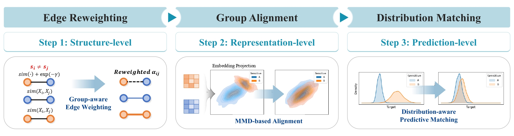

# FnRGNN: Distribution-aware Fairness in Graph Neural Network
FnRGNN is a fairness-aware framework for graph neural network–based node regression. By combining edge reweighting, representation alignment, and prediction normalization, it mitigates bias in continuous regression tasks while preserving model performance.


## Requirements & Setup
This codebase utilizes Anaconda for managing environmental dependencies. Please follow these steps to set up the environment:
1. **Download Anaconda:** [Click here](https://www.anaconda.com/download) to download Anaconda.
2. **Clone the Repository:**
Clone the repository using the following command.
   ```bash
   git clone https://github.com/sybeam27/FnRGNN.git
   ```
3. **Install Requirements:**
   - Navigate to the cloned repository:
     ```bash
     cd FnRGNN
     ```
   - Create a Conda environment from the provided `env.yml` file:
     ```bash
     conda env create -f env.yml
     ```
   - Activate the Conda environment:
     ```bash
     conda activate fair-gnn
     ```
This will set up the environment required to run the codebase.

## Datasets
Below are the github links for datasets used in our experiments:

All datasets should be stored in the `datasets` folder, with each dataset placed in a subfolder named after the dataset (e.g., `datasets/NBA/`, `datasets/NIFTY/`, etc.).

1. **Pokec** [(GitHub)](https://github.com/EnyanDai/FairGNN)
2. **NBA** [(GitHub)](https://github.com/EnyanDai/FairGNN)
3. **German** [(GitHub)](https://github.com/HongduanTian/NIFTY/tree/main)

## Thanks to
We extend our gratitude to the authors of the following libraries for generously sharing their source code and dataset:
[FairGNN](https://github.com/EnyanDai/FairGNN),
[FMP](https://github.com/zhimengj0326/FMP),
[NIFTY](https://github.com/HongduanTian/NIFTY/tree/main).

Your contributions are greatly appreciated.

## Citation
```
CIKM 2025
```